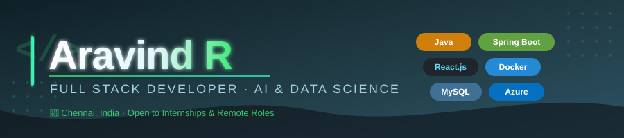

<div align="center">


<a href="https://aravind-r-portfolio.vercel.app//"></a>
<a href="https://www.linkedin.com/in/aravind-r-16b1b4313/"></a>
<a href="https://github.com/ARAVIND23005370"></a>
<a href="https://leetcode.com/u/Aravind_R4/"></a>
<a href="mailto:aravind.rameshrd@gmail.com"></a>

<br/><br/>


</div>

---

##  Who Am I?

I'm pursuing **B.Tech in Artificial Intelligence & Data Science** who builds things that actually work in production — not just in tutorials.

Right now I'm focused on **Java + Spring Boot backends** with **React.js frontends**, building systems that are secured with JWT, containerized with Docker, and designed to scale. I've shipped real features at an internship, built microservices that process 200+ document types, and I'm just getting started.

I don't just write code. I think about **architecture, security, and maintainability** from the start.

```java
public class Aravind {
    String role       = "Full Stack Developer (Java · Spring Boot · React.js)";
    String studying   = "B.Tech AI & Data Science @ Saveetha Engineering College";
    String working_on = "Production-grade full stack systems with cloud deployment";
    String looking_for = "Full-time Full Stack / Backend Developer roles";
    String location   = "Chennai, India ";
}
```

---

## Experience

###  Full Stack Developer Intern — **ApproTech** *(Jul 2025)*

> Real work. Real impact. Real deadlines.

| What I Did | Impact |
|---|---|
| Built 5+ RESTful API endpoints in Java & Spring Boot | ↓ 30% backend response time via query optimization |
| Developed 3 reusable React.js components with Hooks + Axios | Seamless end-to-end data flow |
| Engineered 2 normalized MySQL schemas | Efficient cross-layer data retrieval |
| Implemented Spring Security + JWT auth | Zero unauthorized access in test environment |
| Tested 10+ endpoints end-to-end via Postman | Documented all request/response contracts |
| Participated in 2-week Agile sprint cycles | Consistent on-time feature delivery |

---

##  Projects

> Sorted by complexity. Each one has real architecture decisions, not just CRUD.

---

###  Document Intelligence & Decision Automation System

**Stack:** `Java` `Spring Boot` `REST APIs` `MySQL` `OCR` `Maven` `JUnit`

[](https://github.com/ARAVIND23005370/End-to-End-Document-Workflow-Automation)

**What it does:** A backend system that ingests documents, extracts structured data via OCR, and automatically routes decisions — zero manual reading required.

**The numbers:**
- Handles **200+ document types** automatically
- 6+ threshold-based evaluation rules → **~50% faster** than manual workflows
- **80%+ code reusability** across invoice, HR, legal, and contract workflows
- 4 modular microservices with clean API contracts: doc management · OCR · rule eval · routing

---

###  AI Resume Analyzer Web App

**Stack:** `Python` `NLP` `Streamlit`

[](https://github.com/ARAVIND23005370/AI-Resume-Analyzer)

**What it does:** Parses resumes with NLP, extracts skills + keywords, and scores candidate-job compatibility.

- Validated across **50+ test resumes** with accurate compatibility scoring
- Automated keyword and structure analysis → **~40% less** manual screening effort

---

##  Tech Stack

<table>
<tr>
<td valign="top" width="33%">

** Core**
- Java (primary language)
- Spring Boot
- React.js + React Hooks
- JavaScript (ES6+)
- REST APIs (JSON/HTTP)
- MySQL

</td>
<td valign="top" width="33%">

** Backend**
- Spring Security
- JWT / OAuth 2.0
- JPA + Hibernate
- Lombok
- Swagger / OpenAPI
- Microservices Architecture

</td>
<td valign="top" width="33%">

** Frontend**
- React.js Component Architecture
- Context API
- Axios / Fetch API
- HTML5 + CSS3
- Responsive UI Design

</td>
</tr>
<tr>
<td valign="top">

** Databases**
- MySQL
- Microsoft SQL Server
- Oracle SQL
- H2 (testing)

</td>
<td valign="top">

** DevOps & Cloud**
- Docker
- Microsoft Azure
- AWS (EC2,S3,RDS basic)
- Git + GitHub
- Maven

</td>
<td valign="top">

** Testing & Tools**
- Postman (API testing)
- JUnit (unit testing)
- IntelliJ IDEA
- VS Code

</td>
</tr>
</table>

---
##  GitHub Stats

<div align="center">


&nbsp;


</div>

<div align="center">

[](https://git.io/streak-stats)

</div>

<div align="center">

[](https://github.com/ashutosh00710/github-readme-activity-graph)

</div>

---

##  Certifications

| Certification | Issuer | Type |
|---|---|---|
| Oracle SQL Certified Specialist | Oracle | Technical |
| NPTEL – Internet of Things | NPTEL | Elite Grade |
| PyTorch Ultimate | Coursera | ML/AI |
| Azure Learning Challenge | Microsoft | Cloud |
| Software Engineering Virtual Experience | JPMorgan Chase (Forage) | Professional |
| Software Engineering Fundamentals | IBM | Professional |
| Google Gen AI Exchange Hackathon | Google Cloud × Hack2Skill | Achievement |

---

##  Currently

-  Building more production-grade full stack projects for portfolio
-  Deepening knowledge of **System Design** and **Cloud Architecture**
-  Open to full-time Associate Engineer / Full Stack Developer roles
-  **Best way to reach me:** [aravind.rameshrd@gmail.com](mailto:aravind.rameshrd@gmail.com)

---

##  Let's Connect
> *If you're a recruiter, developer, or someone building something interesting — I'm always open to a conversation.*

<div align="center">

<a href="https://www.linkedin.com/in/aravind-r-16b1b4313/"></a>
&nbsp;
<a href="mailto:aravind.rameshrd@gmail.com"></a>
&nbsp;
<a href="https://aravindr-portfolio.vercel.app/"></a>

<br/><br/>


</div>
